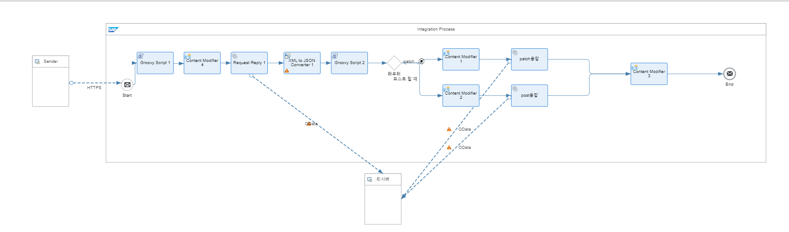

# CPI과제 요구사항

***1.CPI 수신***
```json
{
    "Name": "Test",
    "AdditionalName": "test"
}
```
***2.CoporateAccountCollection oData 조회*** <br>
***-이름 존재여부 Check*** <br>
***3.존재 시 AdditionalName 업데이트*** <br>
***4.미존재시 생성*** <br>
***5. 결과여부 Return***

## REST API
|INPUT Body|OUTPUT Body||
|---|---|---|
|***Name***|**RST**|**S**||
|***AdditionalName***|**RSTMSG**|**생성 or 변경**|

## oData Info
***Creae Body Example***
```json
{
    "RoleCode": "BUP002",
    "Name": "TEST2",
    "AdditionalName": "TSE"
}
```

## Groovy Script1
```Groovy
/* Refer the link below to learn more about the use cases of script.
https://help.sap.com/viewer/368c481cd6954bdfa5d0435479fd4eaf/Cloud/ko/148851bf8192412cba1f9d2c17f4bd25.html

If you want to know more about the SCRIPT APIs, refer the link below
https://help.sap.com/doc/a56f52e1a58e4e2bac7f7adbf45b2e26/Cloud/ko/index.html */
import com.sap.gateway.ip.core.customdev.util.Message;
import java.util.HashMap;
import groovy.xml.*
import groovy.json.*

def Message processData(Message message) {
    
    def body = message.getBody(Reader) 

    def parser = new JsonSlurper();

    //def json = parser.parserText(body);
    def input = new JsonSlurper().parse(body)
    // message.setProperty("RoleCode", input.RoleCode);
    message.setProperty("Name",input.Name);
    message.setProperty("AdditionalName",input.AdditionalName);
    
    return message;
}
```

## Groovy Script2
```Groovy
/* Refer the link below to learn more about the use cases of script.
https://help.sap.com/viewer/368c481cd6954bdfa5d0435479fd4eaf/Cloud/ko/148851bf8192412cba1f9d2c17f4bd25.html

If you want to know more about the SCRIPT APIs, refer the link below
https://help.sap.com/doc/a56f52e1a58e4e2bac7f7adbf45b2e26/Cloud/ko/index.html */
import com.sap.gateway.ip.core.customdev.util.Message;
import java.util.HashMap;
import groovy.xml.*
import groovy.json.*

def Message processData(Message message) {
    
    def body = message.getBody(Reader) 
    def parser = new JsonSlurper();
    def input =  new JsonSlurper().parse(body);
    def checkName = ""; // checkName이라는 변수 초기화
    
    message.setProperty("JSONDATACHECK", input);
    if (input.CorporateAccountCollection == checkName) {
        checkName = "N"; // checkName이 N 즉 값이 없다면
        message.setProperty("RSTMG", "생성이 완료되었습니다!");
    } else {
        checkName = "Y"; // checkName의 값이 있다면 
        println(input.CorporateAccountCollection.CorporateAccount.ObjectID)
        message.setProperty("ChangeAdditionalName", input.CorporateAccountCollection.CorporateAccount.AdditionalName);
        
        message.setProperty("ObjectID", input.CorporateAccountCollection.CorporateAccount.ObjectID);
        message.setProperty("RSTMG", "변경이 완료되었습니다!");
    }

    message.setProperty("checkName" , checkName);
    message.setProperty("RoleCode", "BUP002") // 하드코딩 
    return message;
}
```
## 결과물
